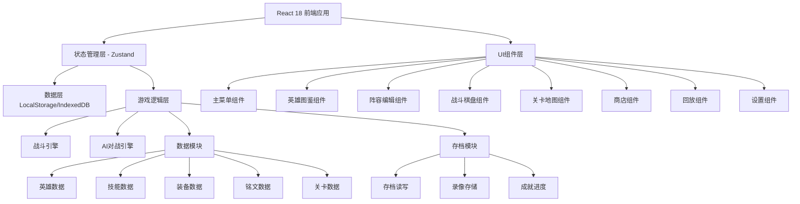

## 1. 架构设计



## 2. 技术描述

- **前端框架**：React@18 + TypeScript@5
- **构建工具**：Vite@5
- **样式方案**：TailwindCSS@3 + CSS Modules
- **状态管理**：Zustand
- **路由方案**：React Router v6
- **动画库**：Framer Motion
- **数据持久化**：LocalStorage + IndexedDB (通过dexie)
- **图标方案**：自定义SVG + Lucide React
- **音频引擎**：Web Audio API (howler.js)

## 3. 路由定义

| 路由路径 | 页面名称 | 说明 |
|-----------|----------|------|
| `/` | 主菜单 | 游戏入口页面 |
| `/heroes` | 英雄图鉴 | 英雄数据浏览 |
| `/lineup` | 阵容编辑 | 英雄编队 |
| `/battle/:levelId` | 战斗棋盘 | 战斗界面 |
| `/map` | 关卡地图 | 关卡选择 |
| `/shop` | 商店系统 | 购买界面 |
| `/replay` | 回放系统 | 录像列表与播放 |
| `/settings` | 设置面板 | 游戏设置 |

## 4. 数据模型

### 4.1 ER图

```mermaid
erDiagram
    PLAYER ||--o{ SAVE_FILE : "创建
    PLAYER {
        string id "玩家ID"
        string name "玩家名称"
        int gold "金币"
        int diamond "钻石"
        int level "等级"
    }
    SAVE_FILE ||--o{ HERO_INSTANCE : "拥有"
    SAVE_FILE {
        string id "存档ID"
        datetime createAt "创建时间"
        int gold "金币余额"
    }
    HERO_INSTANCE }o--|| HERO_TEMPLATE : "基于"
    HERO_TEMPLATE {
        string id "英雄ID"
        string name "英雄名称"
        string role "职业"
        int baseHP "生命"
        int baseATK "攻击"
    }
    HERO_INSTANCE {
        string id "实例ID"
        int level "等级"
        int exp "经验"
    }
    SKILL ||--o{ HERO_TEMPLATE : "拥有"
    SKILL {
        string id "技能ID"
        string name "技能名"
        int cooldown "冷却回合"
        int energyCost "能量消耗"
    }
    EQUIPMENT ||--o{ HERO_INSTANCE : "装备"
    EQUIPMENT {
        string id "装备ID"
        string name "名称"
        string type "类型"
        int price "价格"
    }
    INSCRIPTION ||--o{ HERO_INSTANCE : "装配"
    INSCRIPTION {
        string id "铭文ID"
        string set "套装"
    }
    LINEUP ||--|{ HERO_INSTANCE : "包含"
    LINEUP {
        string id "阵容ID"
        string name "阵容名"
        json positions "站位"
    }
    BATTLE_LOG ||--|| LEVEL : "对应"
    BATTLE_LOG {
        string id "录像ID"
        datetime date "时间"
        bool result "结果"
        json steps "步骤"
    }
    LEVEL {
        string id "关卡ID"
        string chapter "章节"
        string name "名称"
        int difficulty "难度"
    }
    ACHIEVEMENT ||--o{ PLAYER : "完成"
    ACHIEVEMENT {
        string id "成就ID"
        string name "名称"
        bool unlocked "解锁"
    }
```

### 4.2 核心类型定义

```typescript
// 英雄模板
interface HeroTemplate {
  id: string;
  name: string;
  role: '战士' | '法师' | '坦克' | '刺客' | '射手' | '辅助';
  position: '前排' | '中排' | '后排';
  avatar: string;
  description: string;
  baseStats: {
    hp: number; atk: number; def: number;
    speed: number; critRate: number; critDmg: number;
  };
  growthStats: {
    hp: number; atk: number; def: number; speed: number;
  };
  skills: SkillTemplate[];
  recommendedEquipments: string[];
  recommendedInscriptions: string[];
}

// 技能模板
interface SkillTemplate {
  id: string;
  name: string;
  type: '主动' | '被动';
  description: string;
  icon: string;
  cooldown: number;
  energyCost: number;
  range: SkillRange;
  effects: SkillEffect[];
}

// 技能范围
interface SkillRange {
  type: 'single' | 'row' | 'column' | 'cross' | 'all' | 'self' | 'aoe';
  distance: number;
}

// 技能效果
interface SkillEffect {
  type: 'damage' | 'heal' | 'buff' | 'debuff' | 'shield' | 'summon';
  value: number | string;
  duration?: number;
  target: 'enemy' | 'ally' | 'self';
}

// 英雄实例（玩家拥有的英雄
interface HeroInstance {
  id: string;
  templateId: string;
  level: number;
  exp: number;
  star: number;
  equipments: string[];
  inscriptions: string[];
}

// 装备
interface Equipment {
  id: string;
  name: string;
  type: '武器' | '护甲' | '鞋子' | '饰品';
  price: number;
  icon: string;
  stats: Partial<Stats>;
  description: string;
  passive?: string;
}

// 铭文
interface Inscription {
  id: string;
  name: string;
  setName: string;
  color: '红' | '蓝' | '绿';
  stats: Partial<Stats>;
  setBonus: { count: number; effect: string }[];
}

// 站位
interface Position {
  row: number;
  col: number;
}

// 阵容
interface Lineup {
  id: string;
  name: string;
  heroes: {
    heroId: string;
    position: Position;
  }[];
}

// 战斗中的英雄
interface BattleHero {
  instanceId: string;
  currentHP: number;
  maxHP: number;
  currentEnergy: number;
  maxEnergy: number;
  position: Position;
  buffs: Buff[];
  skillCooldowns: Record<string, number>;
  isAlly: boolean;
}

// Buff/Debuff
interface Buff {
  id: string;
  name: string;
  type: 'buff' | 'debuff';
  duration: number;
  effects: Partial<Stats>;
}

// 战斗步骤
interface BattleStep {
  turn: number;
  actorId: string;
  action: 'attack' | 'skill' | 'defend' | 'wait';
  skillId?: string;
  targets: string[];
  results: BattleResult[];
}

// 战斗结果
interface BattleResult {
  targetId: string;
  damage?: number;
  heal?: number;
  buffAdded?: Buff;
  buffRemoved?: string;
}

// 关卡
interface Level {
  id: string;
  chapter: number;
  index: number;
  name: string;
  description: string;
  difficulty: 1 | 2 | 3;
  enemies: EnemyConfig[];
  rewards: Rewards;
  recommendPower: number;
  isChallenge?: boolean;
}

// 敌人配置
interface EnemyConfig {
  templateId: string;
  level: number;
  position: Position;
}

// 奖励
interface Rewards {
  gold: number;
  exp: number;
  items?: { type: string; count: number }[];
}

// 成就
interface Achievement {
  id: string;
  name: string;
  description: string;
  icon: string;
  condition: Condition;
  rewards: Rewards;
  unlocked: boolean;
}

// 存档
interface SaveFile {
  id: string;
  name: string;
  createdAt: string;
  heroInstances: HeroInstance[];
  lineups: Lineup[];
  currentLineupId: string;
  gold: number;
  diamond: number;
  levelProgress: Record<string, { cleared: boolean; stars: number }>;
  achievements: Record<string, boolean>;
  battleLogs: BattleLog[];
  settings: GameSettings;
}

// 游戏设置
interface GameSettings {
  bgmVolume: number;
  sfxVolume: number;
  quality: '低' | '中' | '高';
  fullscreen: boolean;
  showDamage: boolean;
  autoSave: boolean;
}
```

## 5. 目录结构

```
src/
├── assets/            # 静态资源
│   ├── images/      # 图片资源
│   ├── audio/      # 音频资源
│   └── fonts/      # 字体
├── components/       # UI组件
│   ├── common/     # 通用组件
│   ├── MainMenu/   # 主菜单组件
│   ├── HeroBook/   # 图鉴组件
│   ├── Lineup/     # 阵容组件
│   ├── Battle/     # 战斗组件
│   ├── Map/        # 地图组件
│   ├── Shop/       # 商店组件
│   ├── Replay/     # 回放组件
│   └── Settings/   # 设置组件
├── data/             # 游戏数据
│   ├── heroes.ts    # 英雄数据
│   ├── skills.ts    # 技能数据
│   ├── equipment.ts # 装备数据
│   ├── inscriptions.ts # 铭文数据
│   └── levels.ts    # 关卡数据
│   └── achievements.ts # 成就数据
├── hooks/            # 自定义hooks
├── layouts/          # 布局组件
├── pages/            # 页面组件
├── store/            # 状态管理
│   ├── useGameStore.ts
│   ├── useBattleStore.ts
│   └── useUIS
├── types/            # 类型定义
├── utils/            # 工具函数
│   ├── battle.ts    # 战斗计算
│   ├── ai.ts        # AI逻辑
│   ├── storage.ts  # 存储
│   └── utils.ts
└── styles/           # 全局样式
```

## 6. 核心模块划分

### 6.1 战斗引擎模块

- 回合管理：回合数、行动顺序排序
- 伤害计算：攻防公式、暴击、闪避
- 技能系统：效果应用、buff/debuff管理
- AI决策：敌方AI策略选择

### 6.2 存档模块

- 本地存储：JSON序列化、IndexedDB持久化
- 自动存档：关键节点自动保存
- 多存档槽：5个存档位管理

### 6.3 战斗录制模块

- 步骤记录：每步操作序列化
- 回放控制：播放/暂停/倍速/跳转
